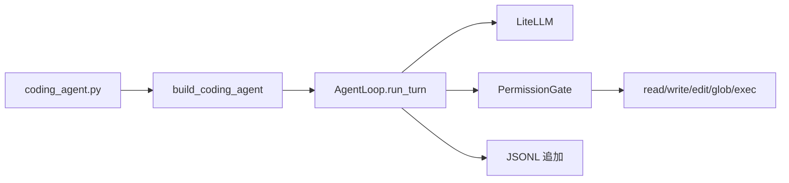

# 项目笔记

## 1. 本仓库在做什么

这是一个 **本地编码 Agent Demo**：自研 `AgentLoop`，再挂上工作区工具、审批和技能目录。模型决定调什么工具；循环负责权限和执行。

和另外两个仓库的差别：

| | 本仓库 | [base-agent](https://github.com/cacohe/base-agent) | [agent-harness](https://github.com/cacohe/agent-harness) |
| --- | --- | --- | --- |
| 循环归谁 | 自研 `AgentLoop` | deepagents | 显式 turn / step 状态机 |
| 语言 | Python | Python | TypeScript |
| 典型用途 | 本地改文件、跑命令 | 把 MCP / RAG 接到现成 SDK | 可恢复、可取消的运行时 |

功能已冻结。后续内核只推进 `agent-harness`。本仓库里的读文件 / 改文件 / 命令行为可以当参考，不要再维护第二套循环。

## 2. AgentLoop

唯一控制流在 `harness/core/loop.py` 的 `run_turn`：一次用户输入是一个 turn，内部可以多轮「调模型 → 执行工具」。

每轮大致是：

1. 把用户句写入内存 `SessionState` 和 transcript
2. 压缩历史、组装 system、列出工具
3. 调模型；若没有 tool_use，走 StopPolicy，然后返回
4. 若有 tool_use：钩子 → `permission.authorize` → `ToolDispatcher.execute` → 把结果当 user 消息再进循环

`harness/api.py` 的 `Harness` 是门面：`create`、`session`、注册工具和 Pack。编码产品装配在 `agents/coding/factory.py`。

## 3. 权限

写文件和执行命令默认不是直接跑。`PermissionGate` 按风险等级裁决：读允许，写/执行询问，网络拒绝。询问走 `ApprovalPort`：CLI 用 `StdinApproval`（终端 `y/N`），测试和 `--yes` 用 `AutoApprove`。

`StdinApproval` 里的 `input()` 会堵住事件循环，只适合这个 REPL Demo。

## 4. Transcript 不是 resume

`JsonlTranscriptStore` 把每条消息追加到 `{data_dir}/transcripts/{id}.jsonl`，`load()` 也能读回来。评测回放会用它。

CLI **不会**把文件读回 `SessionState`。`Harness.session()` 每次都是空消息列表。同一进程里可以连续提问；关掉进程再开，对话要从头来。文件记忆和任务库会留在 `.harness/coding-agent/`。

可恢复会话在 `agent-harness` 里用事件日志做，不要在本仓库补一套。

## 5. LiteLLM

模型走 `harness/models/litellm.py`。`--model` 是 LiteLLM 的模型 id。未传时，若环境里只有一家 `*_API_KEY`，CLI 会选该厂商默认模型；多家同时存在必须显式指定。

官方 API 不需要 `--api-base`。没有模型调用重试。

## 6. 工具与沙箱

默认编码工具：`read_file` / `write_file` / `edit_file` / `glob` / `exec`。路径限制在工作区（`WorkspaceGuard`）。`exec` 用参数列表，不用 `shell=True`。

沙箱后端：`direct`、`bubblewrap`、`docker`。`--sandbox auto` 在没有 bwrap/docker 时等于 `direct`。命令超时默认 60 秒。

MCP、teams、cron、knowledge 在库里有实现，编码 factory 默认关掉 cron/teams，也不自动挂 MCP。

## 7. Skills

`SkillCatalog` 扫描 `skills/*/SKILL.md`。名称和摘要进 system，正文等模型调用 `load_skill` 再读。仓库自带 `fix-bug`、`explore-codebase`、`code-style`。

## 8. 停止条件

`MaxIterationStopPolicy` 只在模型 **不再调工具** 时检查。如果模型一直 tool_use，循环不会因 `max_iterations` 停下。没有取消令牌；Ctrl+C 主要在两次 `coding >>` 之间生效。

## 9. 测试与 CI

测试用 `tests/fakes.py` 的 `FakeModelClient`，不断言真实网络。CI 在 `main` / `master` 的 push 和 PR 上跑 Ruff 和 pytest。

## 10. 已知缺口（保活时先看这里）

1. **没有 resume。** transcript 可回放，不能当会话恢复。
2. **没有中途取消 / 模型重试。**
3. **`max_iterations` 管不住纯工具死循环。**
4. **MCP / teams / cron 不是默认产品路径。** 不要在冻结后把它们接进 CLI。
5. **内核后续只写 [agent-harness](https://github.com/cacohe/agent-harness)。**
